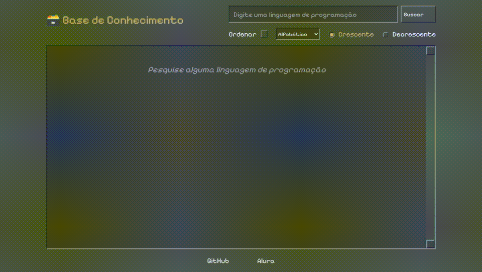
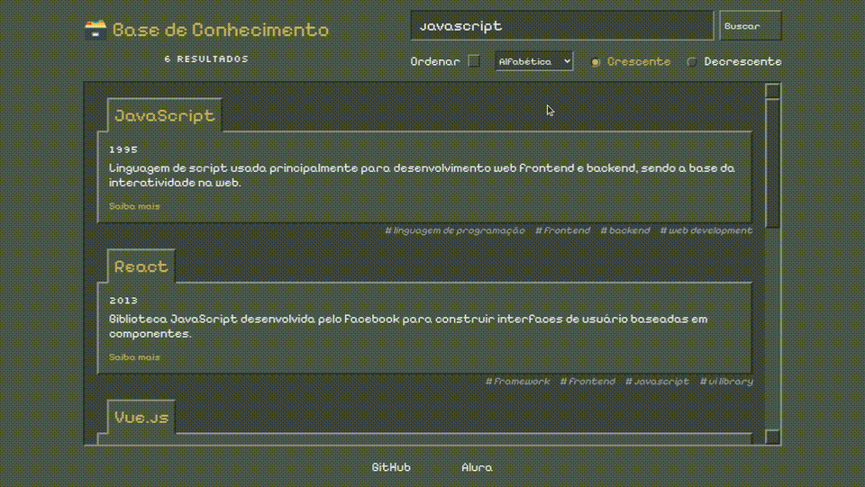
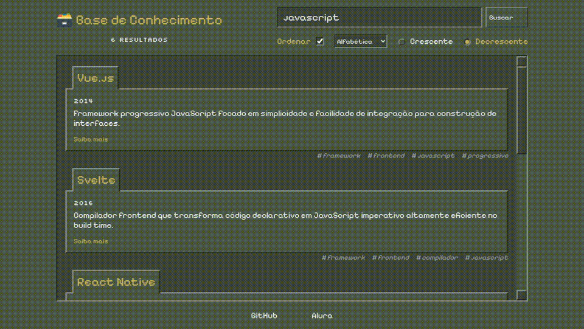
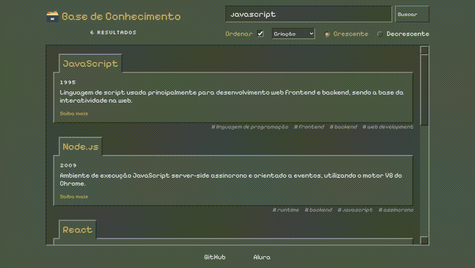

# Imersão DEV 10 - Alura
Aplicação para pesquisar sobre linguagens de programação com os dados gerados pelo (Gemini).



## O que ele faz
- Pesquisa pelo nome da linguagem de programação ou palavra-chave
- Ordena pelo Nome ou Ano de Criação

### Ordem Alfabética


### Ordem Ano de Criação


### Pesquisar com a palavra-chave


### Arquivos principais
- [index.html](index.html) — principal arquivo que estrutura a aplicação.
- [scripts.js](scripts.js) — script que contém todas as funcionalidades.
- [styles.css](styles.css) — estilização da aplicação.
- [data.json](data.json) — arquivo de dados que será utilizado na pesquisa.

# Gerador de dado da Base de Conhecimento (Gemini)

Cria e expande automaticamente uma base de conhecimento em JSON adicionando, em cada execução, 50 novas entradas únicas sobre tecnologias (linguagens, frameworks, ferramentas, bancos de dados, metodologias). A lógica usa a API Gemini para gerar conteúdo estruturado e valida/mescla o resultado com o arquivo local `data.json`.

## O que ele faz
- Gera exatamente 50 novas entradas em formato JSON.
- Evita repetir nomes já presentes na base.
- Faz validação básica da resposta (garante que seja um ARRAY com 50 objetos).
- Realiza tentativas com backoff exponencial em caso de falhas.
- Atualiza (sobrescreve) o arquivo `data.json` com a base combinada.

### Pré-requisitos
- Node.js instalado (v16+ recomendado).
- Chave da Gemini API.

### Como executar
1. Entre na pasta node
   ```js
     cd node
   ```
   
1. Instale dependências:
   ```js
     npm install
   ```

3. Renomeie o arquivo `.env.example` para `.env` e preenchar o campo:
   GEMINI_API_KEY = SUA_CHAVE_AQUI

4. Execute:
   ```js
     npm start
   ```

### O que esperar
- Ao finalizar, o arquivo `data.json` será atualizado com as entradas antigas + 50 novas geradas.
- Logs no console informam sucesso, número de itens e possíveis erros.

### Onde ajustar comportamento
- Para alterar a quantidade gerada, edite a constante `TOTAL_ITEMS` em [generator.js](node/generator.js) (`TOTAL_ITEMS`).
- Função responsável pela geração: [`generateNewKnowledge`](node/generator.js).
- Fluxo principal: [`main`](node/generator.js).

### Arquivos principais
- [generator.js](node/generator.js) — script principal que chama a API e atualiza a base.
- [data.json](node/data.json) — arquivo de dados que será atualizado.
- [package.json](node/package.json) — configuração do projeto e script de start.
- Crie [.env](node/.env.example) na raiz com a variável GEMINI_API_KEY.

### Avisos rápidos
- O arquivo `data.json` será sobrescrito ao final do processo.
- Verifique limites e custos da API Gemini antes de executar em escala.
